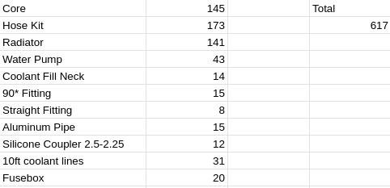
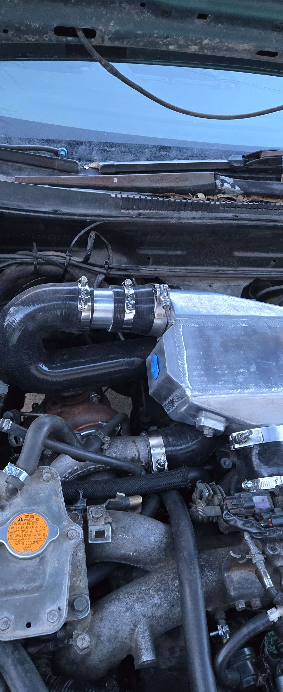
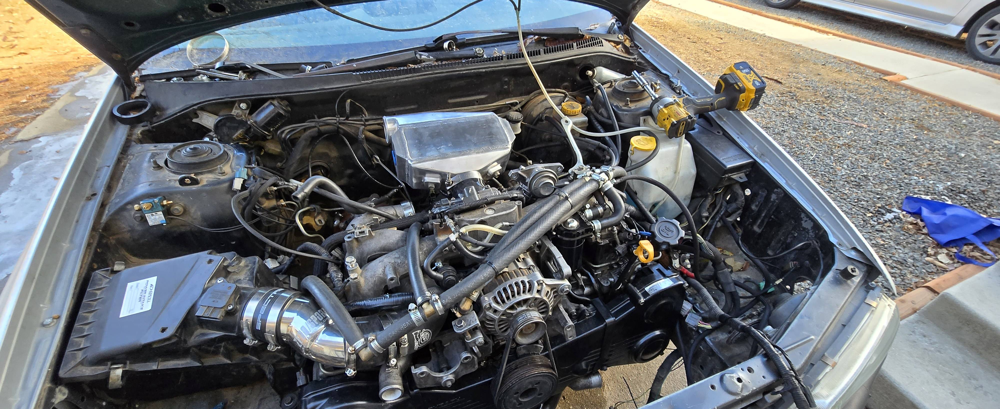

# Air-Water-Intercooler

Raven's DIY AWIC setup looks as follows:

## Links for Parts

- Core: <https://www.frozenboost.com/air_water-ic/water-to-air-intercoolers-p-214.html>
    - Similar looking alternative <https://races-shop.com/water-intercoolers/82739-water-intercooler-univerzal-115-x-255-x-150mm-76mm.html>
- Hose Kit: <https://a.aliexpress.com/_ms7wyYH>

## Pictures of Raven's Setup

