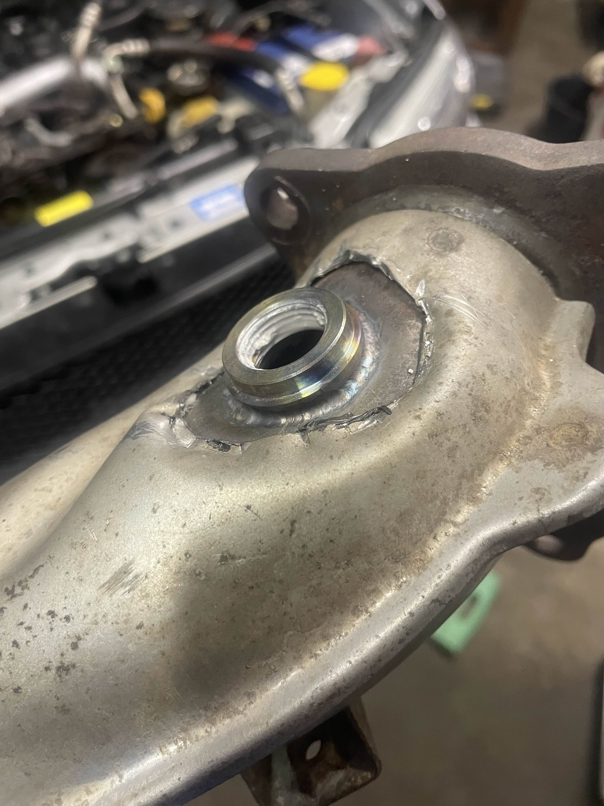

On most Subies you can actually scale your front A/F sensor to read down to low 10's which is enough for tuning!

The important thing is that you need to have your (pre-cat) front O2 sensor **post-turbo** in the downpipe. On direct injection models it should already be located in the downpipe. But on older models you will usually find your front O2 sensor in the manifold collector just before the uppipe.  
The issue with that is that under boost, you will end up with pressure pre-turbo which skews the sensor readings. You can simply take the OEM sensor out, plug that hole with a generic M18x1.5 lambda plug off of eBay and get a bung welded on in your downpipe.  
Try to be as close to the turbo as possible and avoid putting it on the side where the wastegate flap is located as it gets really hot. Here is where I got my bung welded on:

My Forester's ECU had a limitation unfortunately. Logging the front A/F sensor's current I noticed that it doesn't read below -1.37mA which equaled to approximately 11AFR. I was told that GD Imprezas can happily read lower hence you can scale them lower. For me I decided to buy a Denso front A/F sensor that was made for BRZ/GT86. The ft86club forums had a [thread](https://www.ft86club.com/forums/showthread.php?t=82875) with the scaling for their sensors. I had to extend the wiring to fit my SG. On Imprezas you might get away with re-pinning the connector if you decide to get a BRZ sensor (e.g. if you don't wanna scale your sensor yourself).

The scaling for the Denso `DOX-0570` (BRZ sensor I got) looks as follows (units are `mA` to `AFR`):

| -1.30 | -0.87 | -0.61 | -0.39 | -0.24 | -0.11 | 0.00  | 0.05  | 0.15  | 0.23  | 0.30  | 0.37  | 0.43  |
| ----- | ----- | ----- | ----- | ----- | ----- | ----- | ----- | ----- | ----- | ----- | ----- | ----- |
| 10.00 | 11.02 | 11.76 | 12.50 | 13.20 | 13.97 | 14.70 | 15.21 | 16.22 | 17.23 | 18.25 | 19.26 | 20.28 |

You also gotta remember to set your sensor rich limit to 10.0

I would assume that the BRZ sensor is more accurate than the Impreza sensors. If you look up the Denso page for the seperate sensors you'll notice that the Imprezas and Foresters (including STi) use a sensor of type `A/F`, but the BRZ (and I think some Legacy like the Spec B) use type `Planar A/F`.

## Rescaling Your Own Sensor

You can also rescale your sensor yourself. If you don't have a wideband O2 sensor available for cross-referencing the readings (which I'd presume as you probably wouldn't be reading this otherwise) you can log the following parameters:

- A/F Sensor #1 (AFR)
- A/F Sensor #1 Current (mA)
- CL/OL Fueling\* (status)
- Final Fueling Base
  - If you don't have this parameter available, you can go into your open loop fueling table and log both X and Y axis (usually Engine Speed & Engine Load)
  - later you can use these values to calculate your final fueling base using bi-linear interpolation

<!-- prettier-ignore -->
!!! info "Important"
    You need to have your MAF-scaling and fueling set up properly as well as the O2 sensor relocated already!

Let's start off by verifying the fueling. Perform some WOT pulls and analyze the logs. We gotta make sure that the areas the stock AFR scaling can read are spot on (anything above 11.15 basically).
Look for areas where you've done your WOT pulls. You will notice that your CL/OL status will switch from 8 (closed loop) to 10 (open loop). After that, your A/F Sensor 1 as well as Final Fueling Base should report the same value. Once we have verified that the fueling is spot on, we can look in areas where the AFR goes below 11.15. You won't see any AFR value below 11.15, but you will see your Final Fueling Base go down. Then you compare the Final Fueling Base with your A/F Sensor **current** and rescale the sensor scaling values manually.

## Calculating Final Fueling Base

If you don't have the Final Fueling Base you'll need to check your final fueling base at any given moment based off of your Primary Open Loop Fueling table. Let's say that your Open Loop Fueling table uses Engine Load (g/revs) as X-axis and Engine Speed (RPM) as Y axis. Let's imagine that we want to see what the final fueling base is at `4200` rpm and `1.5` g/revs. Let's also imagine that the closest columns in our OL fueling table are `1.45` and `1.60` as well as rows `4000` and `4400` rpm. So we are somewhere inbetween. I'm not good with math so I like to use online calculators. Here is a little calculator for you to use:

<bilinear-interpolation x1="1.45" x2="1.6" y1="4000" y2="4400" q11="12.06" q21="11.54" q12="11.47" q22="11.20" x="1.50" y="4200"></bilinear-interpolation>

---

<small>Yet again, thanks to Raven for telling me how to rescale the AFR sensor without a reference wideband sesnor. I didn't end up rescaling my sensor, but it was still good to know :)</small>
